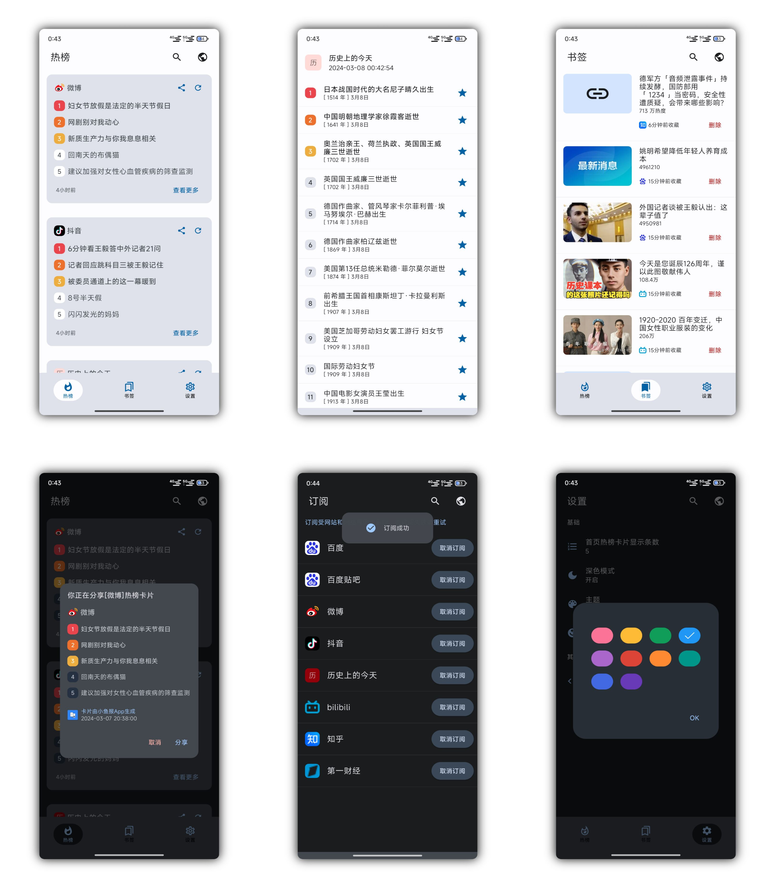

# [小鱼报] nowinnews

[](LICENSE)
[](https://github.com/qcuncle/nowinnews/releases)

一个采用 Material Design 风格实现的聚合热门网站热榜的app

An app gathering hot lists from popular websites using material design.

>  本应用通过 xpath 查询热门站点的热榜数据信息，从而实现通过一个 App 便可以查看订阅的热门网站热榜数据。





### 支持订阅的网站

- [x] 百度
- [x] 百度贴吧
- [x] 微博
- [x] 抖音
- [x] 历史上的今天
- [x] bilibili
- [x] 知乎
- [x] 第一财经
- [ ] 更多待续...
- [ ] more...


### 支持的功能

- [x] 热榜信息查看
- [x] 收藏书签
- [x] 卡片分享
- [x] 订阅设置
- [x] 深色模式 / 主题切换
- [x] 卡片显示条数设置
- [x] 重置订阅配置
- [ ] 更新/上传配置
- [ ] 搜索


### xpath 规则配置说明，以 bilibili 为例

```json
{
    "id": 5,
    "sort": 6,
    "isSubscribed": false,
    "delay": 500,
    "name": "bilibili",
    "host": "https://www.bilibili.com",
    "siteUrl": "https://www.bilibili.com/v/popular/rank/all/",
    "siteIconUrl": "https://www.bilibili.com/favicon.ico",
    "articleXpath": {
      "position": "//*[@id='app']//div[2]/div[2]/ul/li[*]//div[1]/i/span/text()[1]",
      "title": "//*[@id='app']//div[2]/div[2]/ul/li[*]//div[2]/a/text()[1]",
      "url": "//*[@id='app']//div[2]/div[2]/ul/li[*]//div[2]/a/@href",
      "popularity": "//*[@id='app']//div[2]/div[2]/ul/li[*]//div[2]//div/span[1]/text()[1]",
      "imageUrl": "//*[@id='app']//div[2]/div[2]/ul/li[*]//div[1]/a/img/@data-src",
      "parameter": "default"
    }
  }
```


| 字段        | 含义                       | 是否必须                                     |
| ----------- | -------------------------- | -------------------------------------------- |
| id          | 订阅ID (唯一)              | 是                                           |
| sort        | 排序                       | 是                                           |
| delay       | 延时 (根据具体网页设置)    | 是                                           |
| name        | 网站名称                   | 是                                           |
| host        | 网页文章详情的 Host (前缀) | 否（如果能直接爬取到 url 则非必须）          |
| siteUrl     | 网页热榜的地址             | 是                                           |
| siteIconUrl | 网页图标地址               | 否（若没有合适的图标则显示 name 的首个字符） |


| 字段       | 含义          | 是否必须 |
| ---------- | ------------- | -------- |
| position   | 序号          | 否       |
| title      | 标题          | 是       |
| url        | 地址          | 是       |
| popularity | 热度 (或其他) | 是       |
| imageUrl   | 图片地址      | 否       |
| parameter  | 解析规则      | 是       |

> 详细逻辑参见:  [me.qcuncle.nowinnews.data.remote.xpath](https://github.com/QCuncle/nowinnews/tree/main/app/src/main/java/me/qcuncle/nowinnews/data/remote/xpath)


### Thinks

应用使用 Material 默认图标，主题和配色由 Material Theme Builder 构建 [Material Design](https://m3.material.io/theme-builder#/custom).

部分插画来自 [ByteDance IconPark (oceanengine.com)](https://iconpark.oceanengine.com/home)


### License

This App is under Apache-2.0 license.
